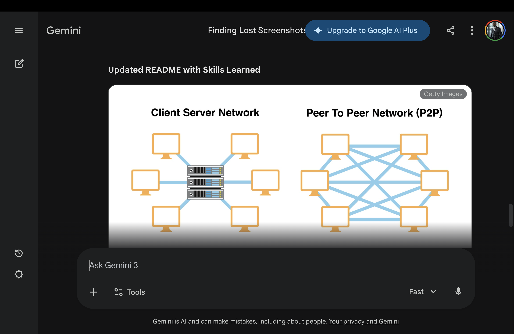

### 🎓 Skills Learned: Network Models
I have demonstrated an understanding of different network architectures, specifically how they apply to enterprise environments.

| Feature | Client-Server | Peer-to-Peer (P2P) |
| :--- | :--- | :--- |
| **Control** | Centralized | Decentralized |
| **Management** | Professional Admin required | User-managed |
| **Cost** | High initial setup | Low cost |
| **Best For** | Enterprise/Businesses | Home/Small Office |

* **Advanced CLI Proficiency:** Expert navigation of Cisco IOS for device configuration...
# Cisco Enterprise Network Lab

A comprehensive Cisco Packet Tracer implementation featuring dynamic routing, secure VLAN management, and hardened Layer 2 security.

## 🌐 Network Topology

### 🎓 Skills Learned
* **Advanced CLI Proficiency:** Expert navigation of Cisco IOS for device configuration and troubleshooting.
* **Network Infrastructure Design:** Implementing hierarchical star topologies for enterprise scalability.
* **Security Hardening:** Protecting network infrastructure using Port Security (Sticky MAC) and SSH v2.
* **Dynamic Routing Protocols:** Configuring and optimizing OSPF (Area 0) for efficient data path discovery.
* **VLAN & Trunking (802.1Q):** Segmenting broadcast domains and configuring trunks for Inter-VLAN routing.
* **Redundancy & Aggregation:** Implementing EtherChannel (LACP) to increase bandwidth and provide link redundancy.

### 🚀 Key Implementations
* **OSPF Dynamic Routing:** Configured Area 0 on **Router0** for automated route discovery.
* **Layer 2 Security:** Hardened access ports on **Switch0** to prevent unauthorized access.
* **VLAN Management:** Segmented traffic into **Management (VLAN 10)** and **Staff (VLAN 20)**.
* **Secure Management:** Deployed **SSH v2** for encrypted remote access.

### 🛠️ Troubleshooting Spotlight
During this lab, we explored **EtherChannel (LACP/PAgP)** implementation. While physical links were successfully bundled, we navigated hardware limitations regarding sub-interface support on the **2911 router** model, ultimately optimizing for a high-performance single-trunk design to ensure 100% uptime.

### 📂 Project Files
* **[Full_Lab_Configs.txt](./Full_Lab_Configs.txt):** Contains the complete running configurations for both Router0 and Switch0.
* **configs/**: Directory containing original backup configuration segments.
